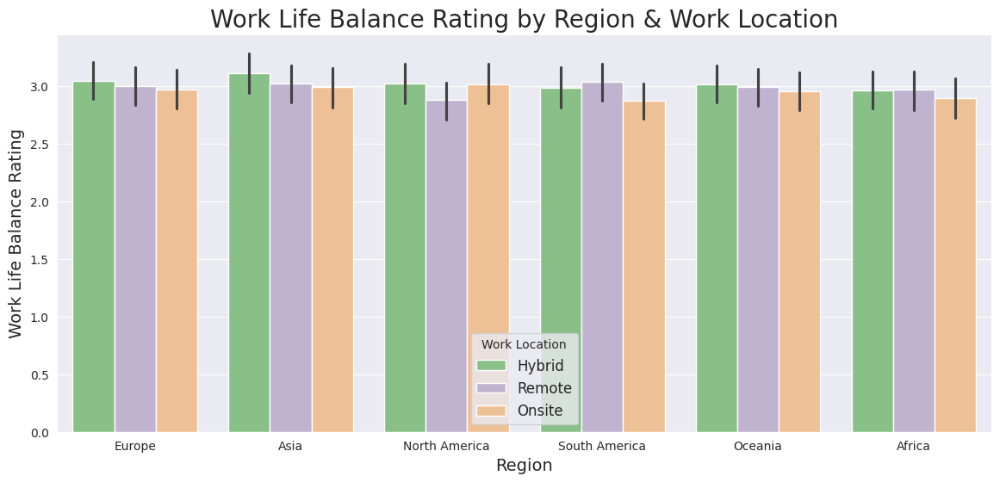

# Work and Mental Health Exploratory Data Analysis

## Project Overview

This project is a comprehensive analysis of a dataset focused on the impact of work on mental health. Using this dataset, I will explore key questions surrounding the challenges and effects of work on employees' mental well-being. The motivating question for this analysis is: **"How can I use Python to gain insights into the relationship between work and mental health?"**

## Data Description

The dataset used in this project is sourced from Kaggle and can be accessed [here](https://www.kaggle.com/datasets/iramshahzadi9/remote-work-and-mental-health). It contains responses from employees across various industries, focusing on their experiences and mental health while working remotely. The data includes columns such as:

- **Age**
- **Gender**
- **Job role**
- **Work-life balance (1-5)**
- **Stress levels (1-3)**
- **Region**

These variables will be analyzed to understand trends and relationships between work conditions and mental health outcomes.

## Key Questions to Explore

- What are the key factors that affect mental health while working?
- How do weekly worked hours correlate with reported stress levels?
- Does stress level vary by industry?
  
## Libraries Used

- **Pandas**: For data cleaning, transformation, and analysis
- **NumPy**: For numerical operations
- **Matplotlib & Seaborn**: For data visualization

## EDA (Exploratory Data Analysis)

**Descriptive Statistics**

While the average work life balance rating doesn't really change much between region, there is a very slight difference between each work location, with Onsite jobs being on average the work location with the lowest average work life balance rating (2.95).

Stress level remains kind of the same between all the industries in the dataset, although the education and the healthcare industries both have a higher average stress level reported between employees (2.05, 2.04, respectively).

**Correlation Analysis**

To see how weekly worked hours affect stress levels among employees, I used this lineplot. There's clearly no correlation between the two variables, as there isn't a trend happening when weekly worked hours increase.
